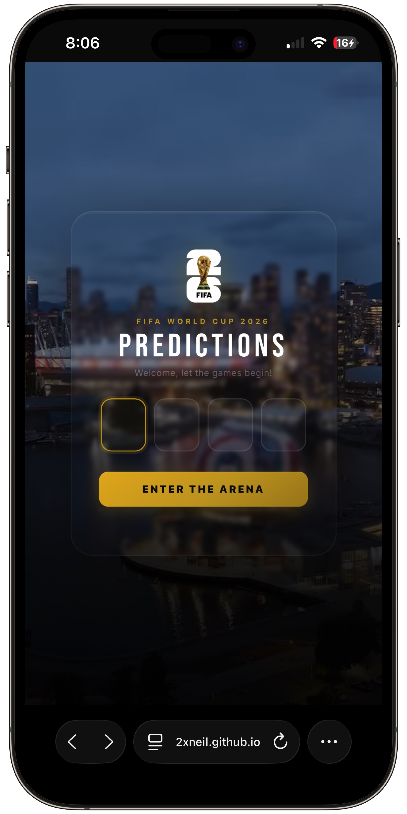
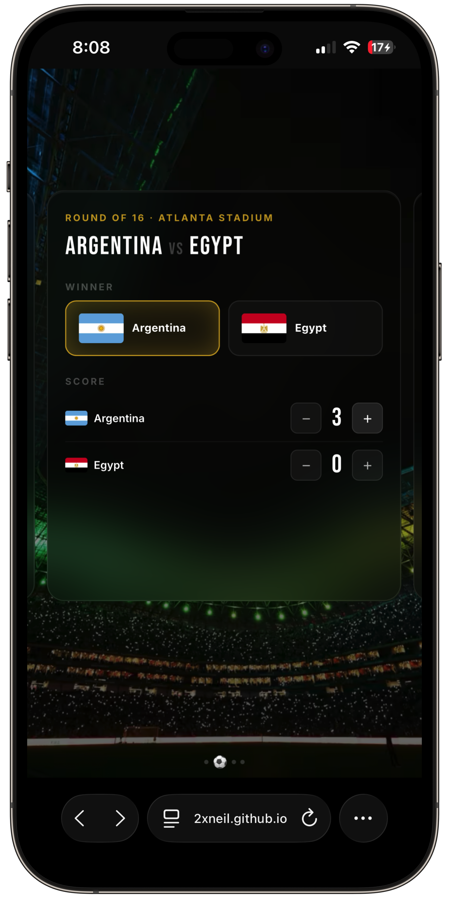
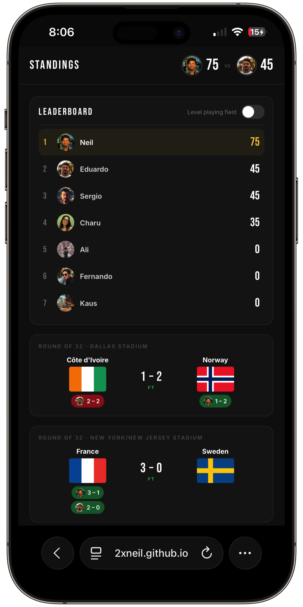

  

<h1 align="center">WC26 Predictions</h1>

  A multiplayer FIFA World Cup 2026 predictions game.

  &nbsp;&nbsp;
  &nbsp;&nbsp;
  

Pick the winner and score for every match, lock in your picks before kickoff, and see how you stack up against your rivals. Built as a single static HTML page, hosted on GitHub Pages, with Google Sheets as a rudimentary database.

## How it works

- Logging in requires a 4-digit PIN
- Once in, you're shown a swipeable carousel of upcoming matches you haven't predicted yet
- Pick a winner and a scoreline for each match. Your opponent's pick for a match stays hidden until you've made your own pick for that match
- A scorecard view shows match results, everyone's picks, and who won the prediction round
- A leaderboard ranks all players, with a fairness toggle that counts everyone from the newest joiner's start game

## Scoring

| Pick | Points |
|---|---|
| Correct winner | +5 |
| Exact scoreline | +10 |
